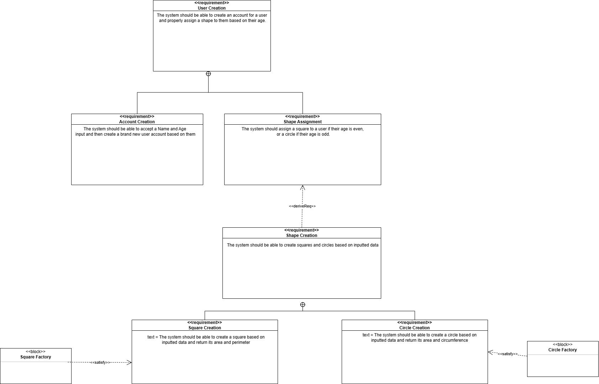

This requirements document is of the factory method example. In it, a user is prompted for their Name and Age. Based on their age, the user can make either and square or circle of whatever radius they want.

